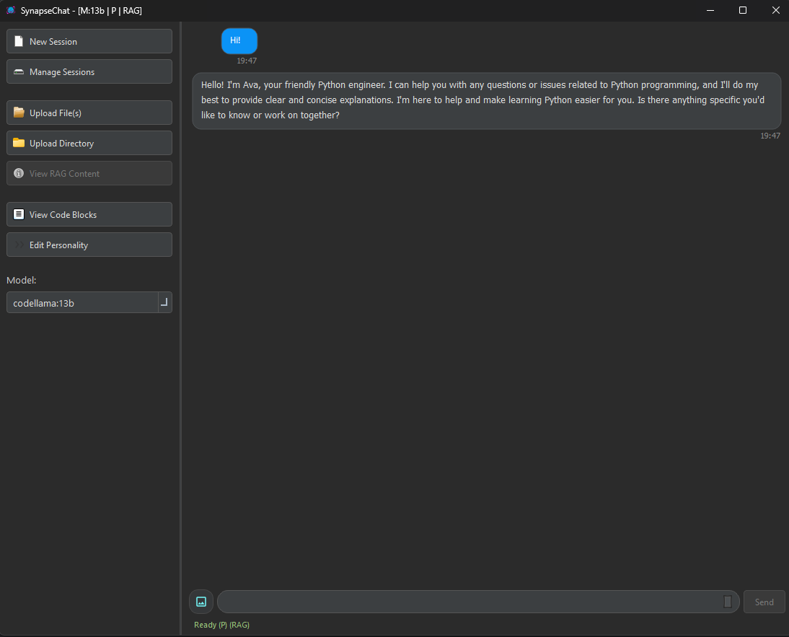
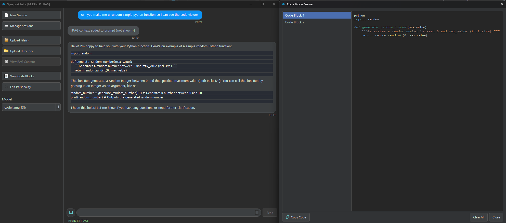

# SynapseChat v3.3-ChromaDB

SynapseChat is a multimodal desktop chat application built with Python and PyQt6. It features a modular backend system supporting local LLMs via Ollama (and optionally Gemini), integrated Retrieval-Augmented Generation (RAG) capabilities for context-aware responses based on your documents, and a modern user interface.



---

## Key Features

* **Modular LLM Backend:** Easily switch between different LLM backends thanks to a defined `BackendInterface`.
    * Includes ready-to-use adapters for **Ollama** (default, supporting local models like CodeLlama) and **Google Gemini**.
* **Retrieval-Augmented Generation (RAG):** Enhance LLM responses with context from your own documents.
    * **Upload:** Add individual files (`.txt`, `.py`, `.md`, `.pdf`, `.docx`, and many more code/text formats) or entire directories to the knowledge base.
    * **Processing:** Automatic text extraction, intelligent chunking (code-aware for Python using Langchain), and embedding generation (Sentence Transformers).
    * **Vector Storage:** Uses **FAISS** (as per `vector_db_service.py`) for efficient semantic search of document chunks. *(Note: Constants/Version name mention ChromaDB, indicating potential future integration or naming)*.
    * **Context Injection:** Relevant document chunks are automatically retrieved based on your query and added to the LLM prompt.
    * **RAG Viewer:** Inspect the indexed documents and chunks directly within the application.
* **Multimodal Input:** Send messages containing both text and images (supported by models like Ollama's LLaVA).
* **Streaming Responses:** AI responses are displayed word-by-word as they are generated.
* **Session Management:** Start new chats, save sessions, load previous conversations, and manage saved files.
* **Customizable Personality:** Define a system prompt to guide the AI's behavior and personality.
* **Code Awareness:**
    * Detects code blocks (` ``` `) in AI responses.
    * Dedicated **Code Viewer** dialog with syntax highlighting (Python) and copy functionality.
* **Modern UI:**
    * Clean, dark-themed interface built with **PyQt6**.
    * Efficient chat display using **Model/View architecture** (`QListView`, `QAbstractListModel`, `QStyledItemDelegate`).
    * Markdown rendering for formatted AI responses (bold, italics, lists, tables, code blocks).
    * Asynchronous operations (`asyncio`, `qasync`) ensure the UI remains responsive during LLM calls and processing.

## Technology Stack

* **Core:** Python 3.x
* **GUI:** PyQt6
* **Async:** asyncio, qasync
* **LLM Interaction:** ollama-python, google-generativeai (optional)
* **RAG Pipeline:**
    * Embeddings: sentence-transformers
    * Vector Store: faiss-cpu
    * Text Splitting: langchain-text-splitters
    * Document Loading: PyPDF2, python-docx
* **Image Handling:** Pillow
* **UI Formatting:** Markdown
* **Configuration:** python-dotenv

## Setup & Installation

**Prerequisites:**

1.  **Python:** Python 3.9 or newer recommended.
2.  **Ollama:** You need Ollama installed and running locally. [Download Ollama](https://ollama.com/).
3.  **Ollama Model:** Pull a model compatible with the application (the default is `codellama:13b`).
    ```bash
    ollama pull codellama:13b
    ```
    *(If you plan to use image input, ensure you have a multimodal model like `llava` pulled: `ollama pull llava`)*

**Installation Steps:**

1.  **Clone the repository:**
    ```bash
    git clone https://github.com/carpsesdema/Syn_LLM.git # Your repo URL
    cd Syn_LLM
    ```
2.  **Create and activate a virtual environment (Recommended):**
    ```bash
    # Windows
    python -m venv venv
    .\venv\Scripts\activate

    # macOS/Linux
    python3 -m venv venv
    source venv/bin/activate
    ```
3.  **Install dependencies:**
    ```bash
    pip install -r requirements.txt
    ```
4.  **(Optional) Configure Gemini API Key:**
    * If you intend to use the Gemini backend, copy the example environment file:
        ```bash
        # Create the file if .env.example doesn't exist yet
        # cp .env.example .env
        echo "GEMINI_API_KEY=" > .env
        ```
    * Edit the `.env` file and add your `GEMINI_API_KEY`.

## Usage

1.  **Ensure Ollama is running** in your terminal.
2.  **Run the application:**
    ```bash
    python main.py
    ```
3.  **Basic Operation:**
    * Type your message in the input bar at the bottom (Shift+Enter for newlines).
    * Click "Send" or press Enter to send.
    * Use the **Left Panel** to:
        * Start a **New Session**.
        * **Manage Sessions** (Load/Save/Delete).
        * **Upload Files/Directories** to the RAG knowledge base.
        * **View RAG Content** to see indexed documents/chunks.
        * **View Code Blocks** detected in the chat.
        * **Edit Personality** (System Prompt).
        * Select the desired backend **Model**.
    * **Attach Images:** Click the "+" button next to the input bar to attach images (requires a compatible multimodal model like LLaVA selected).
    * **Cancel Generation:** Press `Esc` while the AI is generating to attempt cancellation.

## Architectural Highlights

* **Backend Abstraction:** The `backend.interface.BackendInterface` defines a contract for LLM communication, allowing different models/APIs (like Ollama and Gemini) to be plugged in via adapters (`backend.*_adapter.py`).
* **Service Layer:** Functionality like session persistence, file handling, text chunking, image processing, and vector database interactions are encapsulated in dedicated services (`services/*.py`) for better organization and testability.
* **Model/View UI:** The chat interface uses Qt's Model/View pattern (`QListView`, `ChatListModel`, `ChatItemDelegate`) for efficient rendering and state management, significantly improving performance compared to manually creating widgets for each message.
* **Asynchronous Core:** `asyncio` and `qasync` are used to handle potentially long-running LLM API calls without freezing the user interface.

## License

---